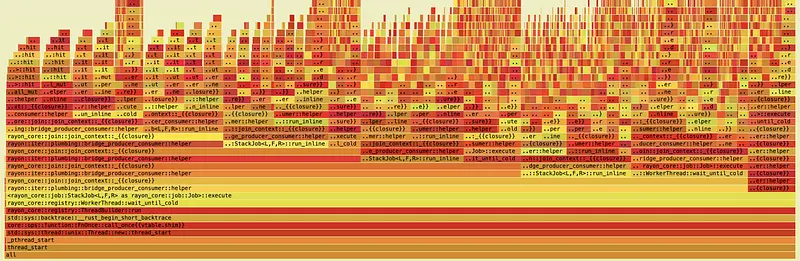
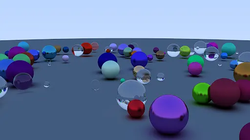
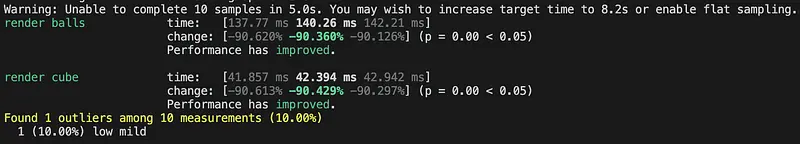
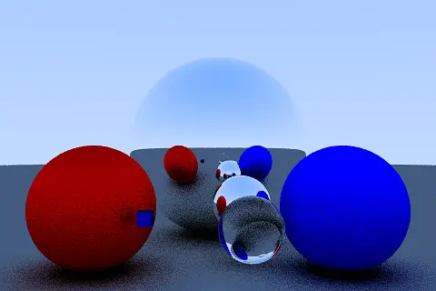
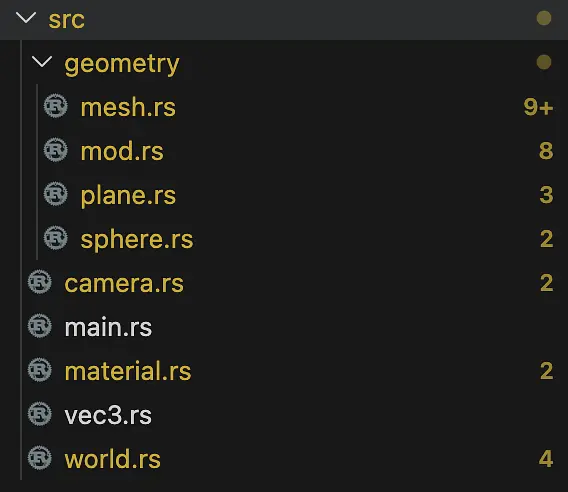
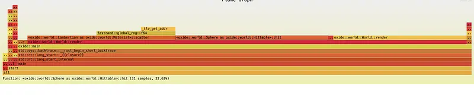

# Deploy to web

This is the devlog I used AI the most for. There are all sorts of black-magic toolchain things that you need to do.

In the end, the shell script has to manually patch things with `sed` to allow for proper imports. I also had to pin an arbitrary nightly version of rustc.

yeah… quite something.

In terms of optimization, the big one here is the illusion of speed. By that I mean progressive rendering. If it loads instantly for the user and it’s responsive, they’ll watch everything render in in real time and be entertained. If it’s 6000 ms to see anything respond to input, they’ll think it’s broken and click off.


# BVH fr

This is where optimization and OOP design merge. So I wanted my BVH to work over any Hittable (thus requiring the type Arc). On large meshes however, this leads to insane heap churn (also triangles aren’t Hittable and don’t own materials). In the end, I implemented a MeshBVH. The type design is sufficiently different that it’s worth the technical debt of code duplication.

I also optimized BVH building for MeshBVH, where the root owns all the objects and bvh nodes just take indices of a Vec.

Finally, I made some beautiful renders! This is the final scene.

Last roadmap item is really just building for WASM. BVH is a magical performance improvement, and with progressive rendering, it’ll actually be snappy.


# BVH

Yes, one feature gets its own devlog. The Raytracing in One Weekend book calls it “by far the most difficult and involved part.”

It’s great to be able to collide with objects in O(log n) time instead of O(n). For the 100 spheres benchmark, this has sped it up 10x again, down to 10.285 ms! (±0.7 ms)

No new picture because it looks literally the same, but it’s a lot faster. Between this and Rayon, it’s now two orders of magnitude faster!

There was another optimization suggested, where you split on the longest axis, instead of a random one, but I found that it was actually 15% slower, so I didn’t do it. Empirical testing!

The one thing is that the flamegraph’s now all choppy because of Rayon.

At this point, my code’s too fast for the testing harness. 2ms is too noisy, so I’ll make harder tests to bench against. Anyways, if you see the ms number go up after this devlog, that’s why.



# Easy roadmap items

random spheres test scene render
Switch to Möller–Trumbore for triangles
optimize more: gamma correction, russian roulette termination, bench hardness (timing + correctness)
optimize more: bench hardness (timing + correctness)
Add rayon finally!

Moller-trumbore saves many cycles on triangles, gamma correction is for correctness, roulette uses fewer cycles AND more bounces, and bench finally lets me quantify these things

And yeah, using multiple cores made it go 10x faster

In terms of benchmarking, I now have very concrete, statistically-significant automatic tests to point to

```
render balls time: [137.77 ms 140.26 ms 142.21 ms]
change: [−90.620% −90.360% −90.126%] (p = 0.00 < 0.05)
Performance has improved.

render cube time: [41.857 ms 42.394 ms 42.942 ms]
change: [−90.613% −90.429% −90.297%] (p = 0.00 < 0.05)
Performance has improved.
```

Here’s a cool high-resolution render. And now I finally have real CI tooling, like a mature programmer (lint + regression test + benchmark???)

Next to do:
BVH (this is the other big optimization)
lights
progressive rendering




# Devlog 2: Adding stuff

I added most of the things on the roadmap: Shiny things, dielectric (glass)… and that’s it.

I also added ray-triangle intersection! So I can now render meshes, like a cube. I got ambitious and wanted to render a teapot, but 10k triangles with no BVH is NOT the move. So I’ll implement BVH down the line

The other thing I did was restructure the code. 500-line world.rs was getting pretty unweildy, so I learned Rust project management and made a proper folder tree

TODO:
Switch to Möller–Trumbore for triangles
ADD BVH!
add cool lights




# Devlog one– wrote the raytracer

This will be the most boilerplate-heavy devlog.
I made a Vec3 class in it’s own module, and then promptly decided to put all of my other raytracing business logic in world.rs. In there, there’s Camera, Material, Lambertian, HitRecord, Hittable, Sphere, HittableList (BVH later), and World !
I’m also using the image crate because I couldn’t be bothered to make file IO, and the no-dependencies bragging rights cannot be that good.

My initial image that came out was just a flat red circle. Then I realized that I had symmetric shading everywhere, so I added the giant floor sphere.

aand the initial render times SUCKED! 8.598s to render frames at this crappy 400x300 resolution.

Rather than guessing or asking AI, I just actually ran perftests with flamegraph. The quickest win is to build for release.
RNG was weirdly taking pretty long (in the hot path), so I switched to fastrng
I also started using squared distances as comparison instead.
The final unexpected thing was that tan() was being called in the hot path when I literally could have just cached it. So that’s what I did.

Now it renders in just 500ms!
Roadmap:
add planes, add glass, add checkerboard, add lights, optimize more
I’ve also attached the current flamegraph.



