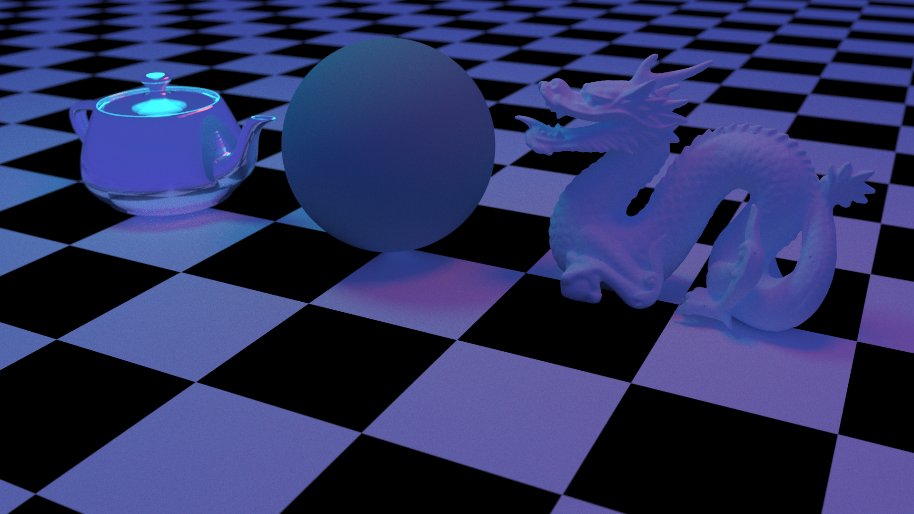
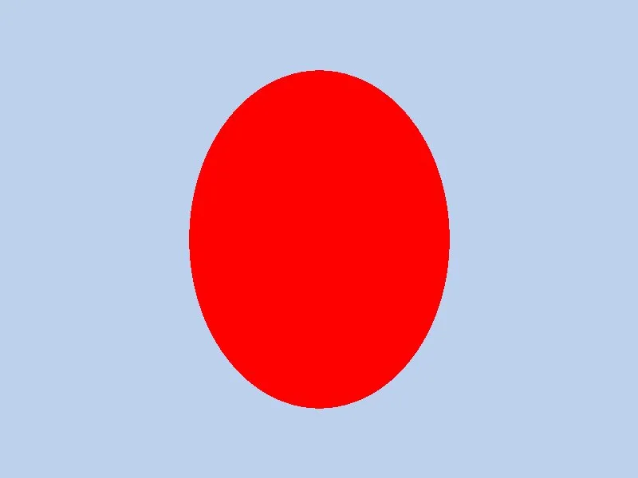

# oxide



### Run it here!

[oxide-460.pages.dev](https://oxide-460.pages.dev/)

A physically accurate CPU path tracer written in Rust. Compiles to WASM.

Features include:

- Path tracing with global illumination
- Two-level BVH acceleration (O(log n) intersection)
- Glass, mirror, diffuse materials
- Mesh loading (STL)
- Multithreaded via Rayon
- Progressive WASM renderer
- Russian roulette termination

Even on web, even on the CPU, it's quite responsive:


My initial image that came out was just a flat red circle.



Then I realized that I had symmetric shading everywhere...

## Running natively

You'll need to clone and `cargo run --release`. That's pretty much it. Edit main.rs for a different scene, if you'd like.

You can get some truly amazing speeds natively! Especially with SIMD.

I've made an effort to make the tooling very nice! You can benchmark with `cargo bench`, build WASM with `bash build.sh`, and serve WASM with `bash serve.sh`.

No tests right now because it's nondeterministic timing with the threads even if the RNG is set-seed, and I know the math works because it, well, renders images that look right.

## Devlog

[Full devlog ->](DEVLOG.md)

## Optimization

A path tracer is a very computationally heavy task, and deploying to the web on CPU is like shooting yourself in the foot twice.

<details><summary>Here are my optimization devlog entries from start to finish: </summary>
My initial image that came out was just a flat red circle. Then I realized that I had symmetric shading everywhere, so I added the giant floor sphere.

aand the initial render times SUCKED! 8.598s to render frames at this crappy 400x300 resolution.

Rather than guessing or asking AI, I just actually ran perftests with flamegraph. The quickest win is to build for release.
RNG was weirdly taking pretty long (in the hot path), so I switched to fastrng
I also started using squared distances as comparison instead.
The final unexpected thing was that tan() was being called in the hot path when I literally could have just cached it. So that’s what I did.

Now it renders in just 500ms!

---

I also added ray-triangle intersection! So I can now render meshes, like a cube. I got ambitious and wanted to render a teapot, but 10k triangles with no BVH is NOT the move. So I’ll implement BVH down the line

---

Switch to Möller–Trumbore for triangles
optimize more: gamma correction, russian roulette termination, bench hardness (timing + correctness)
optimize more: bench hardness (timing + correctness)
Add rayon finally!

Moller-trumbore saves many cycles on triangles, gamma correction is for correctness, roulette uses fewer cycles AND more bounces, and bench finally lets me quantify these things

And yeah, using multiple cores made it go 10x faster

In terms of benchmarking, I now have very concrete, statistically-significant automatic tests to point to

```
render balls            time:   [137.77 ms 140.26 ms 142.21 ms]
                        change: [−90.620% −90.360% −90.126%] (p = 0.00 < 0.05)
                        Performance has improved.

render cube             time:   [41.857 ms 42.394 ms 42.942 ms]
                        change: [−90.613% −90.429% −90.297%] (p = 0.00 < 0.05)
                        Performance has improved.
```

Here’s a cool high-resolution render. And now I finally have real CI tooling, like a mature programmer (lint + regression test + benchmark???)

---

Yes, one feature gets its own devlog. The Raytracing in One Weekend book calls it “by far the most difficult and involved part.”

It’s great to be able to collide with objects in O(log n) time instead of O(n). For the 100 spheres benchmark, this has sped it up 10x again, down to 10.285 ms! (±0.7 ms)

No new picture because it looks literally the same, but it’s a lot faster. Between this and Rayon, it’s now two orders of magnitude faster!

There was another optimization suggested, where you split on the longest axis, instead of a random one, but I found that it was actually 15% slower, so I didn’t do it. Empirical testing!

The one thing is that the flamegraph’s now all choppy because of Rayon.

At this point, my code’s too fast for the testing harness. 2ms is too noisy, so I’ll make harder tests to bench against. Anyways, if you see the ms number go up after this devlog, that’s why.

---

In terms of optimization, the big one here is the illusion of speed. By that I mean progressive rendering. If it loads instantly for the user and it’s responsive, they’ll watch everything render in in real time and be entertained. If it’s 6000 ms to see anything respond to input, they’ll think it’s broken and click off.

</details>
